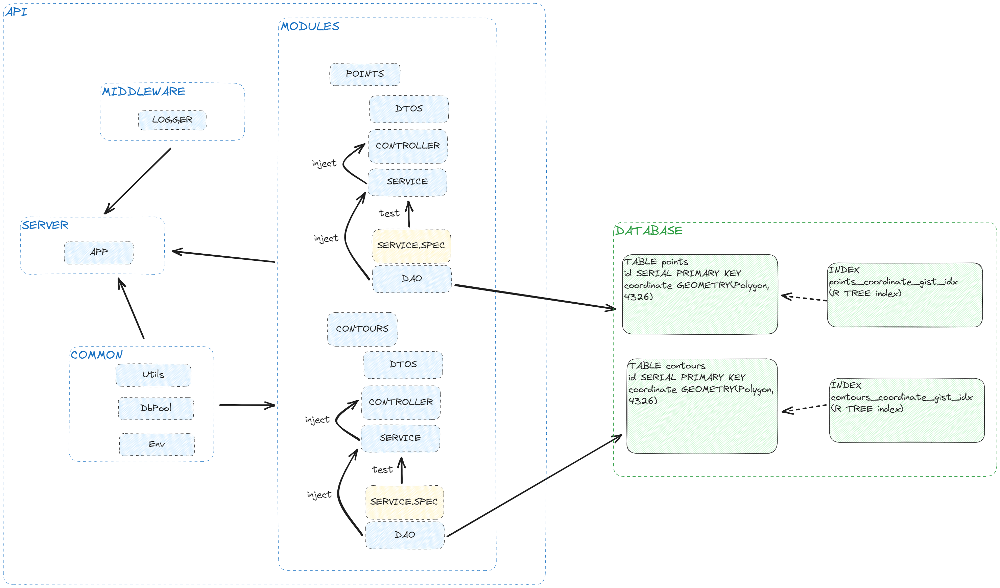

# 1. Overview
This repository contains the code for a GEO REST API built with NestJS and a PostgreSQL database for storing geographic data. 
The API supports CRUD operations for two data types: Point and Contour.

## 1.1 Technologies
- `PostGIS` extends the capabilities of the PostgreSQL relational database by adding support for storing, indexing, and querying geospatial data.
- `NestJS` A progressive Node.js framework for building efficient, reliable and scalable server-side applications. 

## 1.2 Architecture

<br>

The solution has a standard architecture, an `app` mades of modules, Each module is composed of:

- a `controller` to handle HTTP exchanges
- a `service` to handle the business logic
- a `DAO` to handle SQL queries 
<br>

**Observation** Due to the complexity of some SQL spatial queries, I opted not to use an ORM (Object-Relational Mapping) for managing SQL transactions. Instead, I chose to implement DAO (Data Access Object) classes. The return values of some queries were unfriendly, requiring me to implement regex to extract the necessary data. These data parsing techniques have been thoroughly tested by unit tests. Given more time, I would definitely strive to make the queries more user-friendly to eliminate the need for regex.

<br>

# 2. Installation & deployment

## 2.1 Prerequisite
- docker
- docker-compose

## 2.2 Installation steps
1. Clone the repository:
``` shell
git clone https://github.com/bblanquet/lunit.geo-api.git .
```

2. dockerize API:
``` shell
docker build -t lunit/geo.api:latest ./geo.api
```

3. deploy API + DATABASE
``` shell
docker compose -f .\docker\lunit\docker-compose.yaml up
```

4. swagger
``` shell
http://localhost:3000/api
```

# 3. Usage
The API provides endpoints for managing Point and Contour data.

Database Schema:

    points:
        id (Primary Key)
        coordinate


    contours:
        id (Primary Key)
        coordinates


## 3.2 API Endpoints
Points:
- GET /points?contours=<id>: Retrieve all points.
- GET /points/{id}: Retrieve a specific point by ID.
- POST /points: Create a new point.
- PATCH /points/{id}: Update an existing point.
- DELETE /points/{id}: Delete a point by ID.

Contours:
- GET /Contours: Retrieve all polygons.
- GET /Contours/{id}: Retrieve a specific polygon by ID.
- GET /Contours/{id}/intersection/countour=<id>: Retrieve interesected areas
- POST /Contours: Create a new polygon.
- PATCH /Contours/{id}: Update an existing polygon.
- DELETE /polygons/{id}: Delete a polygon by ID.

# 4. Testing
## 4.1 Prerequisite
- npm
- node-18

## 4.2 Unit tests
``` shell
cd geo.api
npm install
npm run test
```
## 4.3 Dummy data scripts
``` shell
cd scripts
npm i
node ./points
node ./polygons
```

